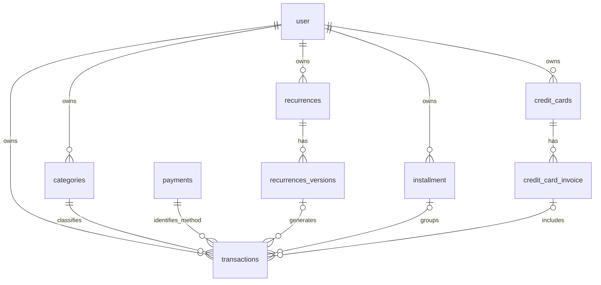

# Data model

This document records the goals, table responsibilities, and decisions for the first version. The implemented schema lives in [`src/main/db/schema.ts`](../src/main/db/schema.ts). Deferred work is tracked in [Future improvements](future-improvements.md).

## Main screen goal

The main screen presents a monthly cash-flow summary and a timeline of financial events. A credit-card purchase can appear in the timeline before its payment affects available cash.

The first version uses these rules:

- Inflows are receipts completed during the month.
- Outflows are direct expenses and invoices paid during the month.
- Monthly balance is inflows minus outflows; it is not an account balance.
- Credit-card purchases may appear as a separate indicator and must not be counted again as cash outflows.

Category analysis should count purchases and installments without counting the invoice payment as another consumption expense.

## Core decisions

### Local profiles and initial catalogs

Profiles are local and open without authentication. Creating a profile stores
its name, email, and `pt-BR` or `en-US` locale. The active profile can change its locale through the profile menu; changes are validated and persisted before the interface updates. Existing or unsupported
preferences fall back to `pt-BR`. The historical password column is retained
for database compatibility; new profiles store a disabled marker, not credentials.
The active profile is held in the main process for the application session.
Restarting requires selecting a profile again; transaction operations require
an active profile and derive ownership from it rather than renderer input.

Default categories use the stable keys `food`, `housing`, `salary`, and `other`.
Categories remain owned by their profile. The shared payment catalog uses `pix`,
`debit`, `credit`, and `cash`; selection and main-process validation accept only
these keys. `pix_credit` remains deferred until its financial rules are defined.
Legacy methods retain their associations, and recognized legacy defaults acquire
catalog keys without replacing their identifiers or customized records.

Catalog display names are translated in the renderer. Customized category names
remain as entered. Retrying initialization preserves existing defaults, including
archived categories. Both supported locales use BRL without changing stored cents.
Monetary entry accepts digits and the profile's decimal separator, with up to two
decimal places; grouping separators and currency-prefixed paste are currently
rejected rather than reinterpreted. Credit selection records a planned entry;
invoice association and all settlement workflows remain deferred. Selecting a
method does not set a payment date.

Creation and editing use separate dialogs. Editing changes only the description,
note, entry type, amount, and reference date. Main preserves category, payment
method, owner, and settlement date regardless of extra fields supplied through
IPC. This also allows editing entries with archived categories or legacy payment
methods without replacing their historical associations.

Leaving or activating a profile resets the renderer's financial state, transaction
draft, submission lock, and pending confirmation. Session changes invalidate
pending edit, catalog, locale, and financial-load responses. Older mutation
completions cannot clear a new draft, refresh another session, or show stale
notifications. Notification providers are recreated when the active profile changes.

### A transaction is one financial entry

`transactions` is the smallest financial unit in the domain: a purchase, salary, bonus, or individual installment. It does not represent every product on a receipt.

An installment purchase creates one transaction per installment. Shared purchase details live in `installment`. No additional transaction should store the full purchase amount because that would duplicate the value.

### Installments and invoices are different concepts

An installment group connects entries from the same purchase over time. An invoice groups card entries for a billing period.

| Example                   | `installment_id` | `credit_card_invoice_id` |
| ------------------------- | ---------------- | ------------------------ |
| One-time card purchase    | Empty            | Set                      |
| Card purchase installment | Set              | Set                      |
| Invoice-based installment | Set              | Empty                    |
| Salary or direct purchase | Empty            | Empty                    |

An `invoice_items` table is unnecessary because each installment is already a transaction. `transactions.credit_card_invoice_id` directly associates an entry with its invoice.

### Invoice payment

The first version pays an invoice in full through one event. `credit_card_invoice.paid_at` is empty while unpaid and stores the payment date after settlement. A date is required so cash flow can attribute the outflow to the correct month.

The payment does not create another expense transaction, and its date is not copied to every purchase on the invoice. Partial and multiple payments are outside the initial scope.

Invoices close on the last day of the month and are due seven calendar days later. Closing, due, and payment dates remain separate. The application must calculate this rule; the current schema only stores concrete dates.

## Table responsibilities

### `user`

Owns financial data and stores `id`, `name`, unique `email`, and `password`. Passwords must contain secure hashes; the schema does not implement authentication or hashing.

### `transactions`

Stores individual income and expense entries. Money uses integer cents. `reference_date` positions the entry in a reporting period, while `payment_date` records actual settlement for a direct entry. Optional foreign keys connect categories, recurrence versions, installments, and card invoices.

`note` is optional plain text. Blank or whitespace-only notes are stored as
`NULL`; nonempty notes have surrounding whitespace trimmed. Existing entries
remain without notes after migration. Editing may change or clear the note;
an update that omits the field preserves its existing value.

Installment group and number must be set together, the number must be positive, and `UNIQUE (installment_id, installment_number)` prevents duplicate positions. The application must still ensure the number does not exceed `installment.total_installments`.

### `installment`

Stores data shared by all installments: name, count, total amount, expected start and end dates, purchase date, and owner. Each installment is a separate transaction. Stored dates and totals must remain consistent with those transactions.

### `credit_cards` and `credit_card_invoice`

`credit_cards` identifies a user's card. An invoice belongs to a card and stores its amount, closing date, due date, and payment date. Transactions join an invoice directly. If `amount_cents` remains stored instead of calculated, the application must update it atomically with invoice entries.

### `payments`

Defines payment methods by name and type. It does not represent invoice payment events. The current schema treats this as a shared catalog because it has no `user_id`.

### `categories`

Classifies entries and stores a display color. Categories belong to users. Invoice payments must not repeat the purchase categories as another expense.

`icon_key` stores a serializable icon identifier (for example, `food` or `salary`),
independent of the editable category name. Supported identifiers are defined by
`CategoryIconKey` in `src/shared/contracts/categories.ts`; Lucide components are
mapped only in `src/renderer/lib/category-icons.ts`. Unknown or missing identifiers
render the `other` icon. Transaction responses expose category details as
`category: { id, name, icon_key }`, with `category: null` for uncategorized entries.

The Drizzle schema gives new categories an `other` default. The prototype seed
assigns icons explicitly. Existing icons from the previous initializer are preserved.
Renaming a category does not change its stored icon. There is currently no category
editing API or icon picker; a future category editor should validate `icon_key`
against the supported identifiers before persisting it.

### `recurrences` and `recurrences_versions`

`recurrences` preserves the continuous identity of a repeating commitment. `recurrences_versions` stores each rule version, including amount, frequency, interval, and validity dates. A recurring transaction points to the version that generated it so historical entries retain their original rule.

Frequency values are 1 daily, 2 weekly, 3 monthly, and 4 yearly. Versions of the same recurrence should not overlap. Changing or resuming a rule creates a new version; correcting one occurrence changes only its transaction.

## Recurrence generation

Occurrences should be generated on demand for the requested period:

1. Find versions whose validity intersects the period.
2. Calculate scheduled dates from the rule's base date, frequency, and interval.
3. Create only missing occurrences.
4. Load the timeline without overwriting existing manual changes.

Generation does not confirm payment. Direct entries keep `payment_date` empty until settlement, while card payment remains represented by the invoice.

A future `scheduled_date` field with `UNIQUE (recurrence_version_id, scheduled_date)` can provide stable occurrence identity. Skipped occurrences also need a persistent exception record so generation does not recreate them.

Open recurrence decisions include month-end dates, leap years, version calendar resets, overlap validation, defaults for generated transactions, and reconciliation after rule changes.

## Relationships

## Timeline and cash-flow example

A R$250 purchase made on August 20 appears in the August timeline. If its invoice closes on August 31, is due September 7, and is paid September 5, the R$250 cash outflow belongs to September. The purchase remains available through the invoice details and is not counted twice.

## Current conventions and limits

- Money is stored as integer cents to avoid floating-point errors.
- Dates use `YYYY-MM-DD`; SQLite's `DATE` declaration does not validate the format.
- Schema constraints and transaction operations are covered by SQLite integration tests.
- Schema changes use versioned Drizzle migrations; see [Database development](database-development.md).
- Cascade deletion behavior remains scheduled for review.
- The schema does not yet generate invoices, recurrences, installments, or summary queries.
